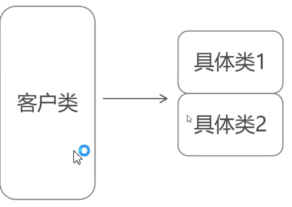
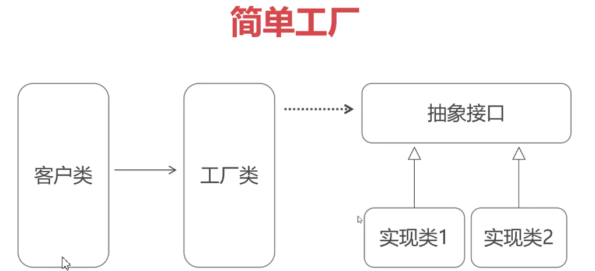

# 简介

创建型模式: 帮助我们如何来精巧地创建对象

结构型模式: 在软件结构上, 通过重构以及抽象让软件结构更有条理更易维护.

行为型模式: 针对现实中某种业务场景, 针对这种行为做的设计与优化.

创建型模式是其他模式的基本

---

创建型模式: 工厂模式


# 工厂模式

创建型模式

* 工厂模式用来隐藏创建对象的细节. 很多类似的类, 实现的工作都基本相同, 用一个类来帮助选择需要的类.

* 工厂模式核心：工厂类（Factory). 一个中间人的角色, 来帮助我们选择指定的类来创建对应的对象. 中间人 -> 工厂类

获取一个对象, 不是new出来, 而是通过工厂类进行创建

* 工厂模式根据行为可以分成: 简单工厂, 工厂方法和抽象工厂. 目的都是问了隐藏创建类的细节, 但是实现的理念不同. 简单工厂: 最简单, 使用最广

## 简单工厂

场景: 买苹果, 以前需要了解每个苹果的特性对应的牌子(红色的甜(红富士), 绿色的酸(青果)). 水果商家, client对商家提出我要买什么样子的苹果, 红的甜的, 商家来进行处理



以前每个Client都需要了解每个具体类的情况

但是引入工厂后, 根据Client的要求, 由工厂类创建就可以了, 



对于原始的具体类, 因为都是相似的, 所有抽象出来一个具体的接口, 再创建一个工厂类, 根据客户的要求(传入的参数), 由工厂类来自动创建对应的实现类, 返回适合的对象. 客户类不再面向具体的实现类, 而是持有抽象的接口. 因为每个类都实现了这个接口, 工厂类返回的时候返回的也是接口, 而不是实现类. 对于Client来说, 不需要关注工厂类创建了哪个具体类, 只需要知道工厂类返回了某一个接口即可.

---

项目应用: i18n国际化. 简单工厂实现

两个人来开发, 一个开发Software整体调用. 一个开发具体的语言类. 

每个语言类都会输出对应语言的"人力管理系统"

```java
public class Chinese implements I18N {
    @Override
    public String getTitle() {
        return "人事管理系统";
    }
}
```

```java
public class English implements I18N {
    @Override
    public String getTitle() {
        return "HR System";
    }
}
```

如果直接这样子暴露给开发人1, 那么开发人1就必须知道每一个类的情况, 了解各个语言, 痛苦

开发人员2了解语言, 所以做一个抽象接口出来, 将这些语言类都实现这个接口

``` java
// Internationlization
public interface I18N {
    public String getTitle();
}
```

并且又提供一个Factory工厂类, 提供静态方法. 简化对象创建的过程

```java
public class I18NFactory {

    public static I18N getI18NObject(String area) {
        if (area.equals("China")) {
            return new Chinese();
        } else if (area.equals("English")) {
            return new English();
        } else if (area.equals("Spain")) {
            return new Spainish();
        } else {
            return null;
        }
    }
}
```

对于开发人员1, 直接面向这个工厂类开发就可以. 我不需要知道语言是什么意思, 只需要知道区域的名字, 也不用关心这个I18N是哪个类实现的, 只需要直接调用方法输出即可

```java
public class Software {
    public static void main(String[] args) {
        I18N china = I18NFactory.getI18NObject("China");
        System.out.println(china.getTitle());
    }
}
```

注意点:

1. 原始类都需要实现相同的接口. 这里的所有语言类都实现了I18N接口
2. 使用的时候, 无论是工厂的方法还是产生的对象, 都是面向接口的. 由工厂类来查看具体的实现类, 并返回对象

```
I18N china = I18NFactory.getI18NObject("China");
```

3. static描述了工厂, 静态工厂. 因为使用了static描述, 使用的时候不需要new Factory, 直接调用对应的静态方法, 简化开发

---

工厂模式: 额外增加工厂类, 隐藏具体类的实现细节, 使用者不关心底层的创建逻辑, 只需要知道工厂和创建对象的方法返回对应的接口即可.

开发人员1和国际化开发人员2之间分工更加明确, 解耦, 我不需要关心国际化的开发, 只需要根据工厂类获取对应的对象即可. 


